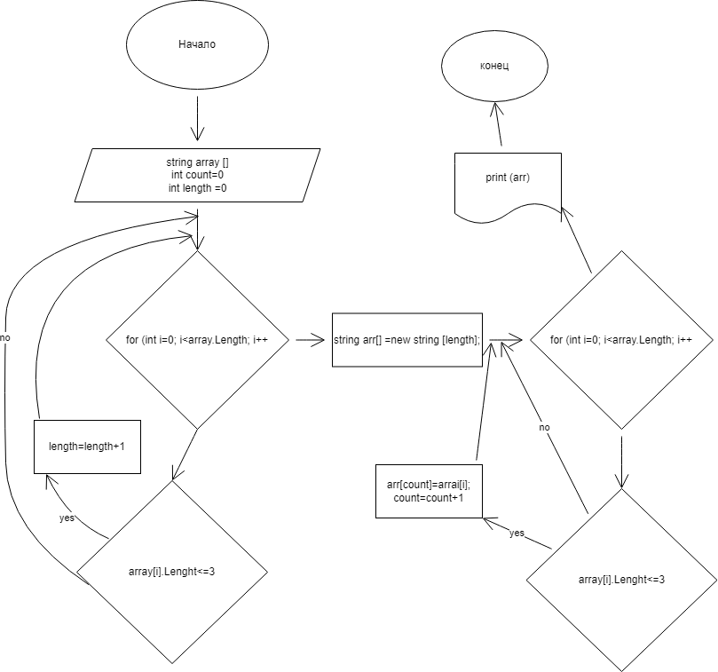

Задача:
________________________________________
Написать программу, которая из имеющегося массива строк формирует массив из строк, длина которых меньше либо равна 3 символа. Первоначальный массив можно ввести с клавиатуры, либо задать на старте выполнения алгоритма. При решении не рекомендуется пользоваться коллекциями, лучше обойтись исключительно массивами.

Примеры:

["hello", "2", "world", ":-)"] -> ["2", ":-)"]

["1234", "1567", "-2", "computer science"] -> ["-2"]

["Russia", "Denmark", "Kazan"] -> []
Алгоритм решения:

•	Создаем метод заполнения DataArray первоначального массива строк с клавиатуры, в котором в качестве знаков разделения элементов используются пробелы или запятые;

•	Создаем метод формирования нового массива ArrayFormation, который из имеющегося массива строк (array) формирует новый массив (arr) из строк, длина которых меньше либо равна 3 символам.

•	Из условия формирования массива из строк, длина которых меньше либо равна 3 символа, определяем его размерность-length;

•	Объявляем второй массив размерностью, вычисленной на первом этапе;

•	Вводим переменную count, определяющую позицию элемента во втором массиве;

•	Заполняем второй массив элементами, длина которых меньше либо равна 3 символам.

•	Создаем метод вывода информации о массиве на консоль PrintArray;

•	Выводим первоначальный массив строк, а также получившийся массив на консоль, используя метод PrintArray.

